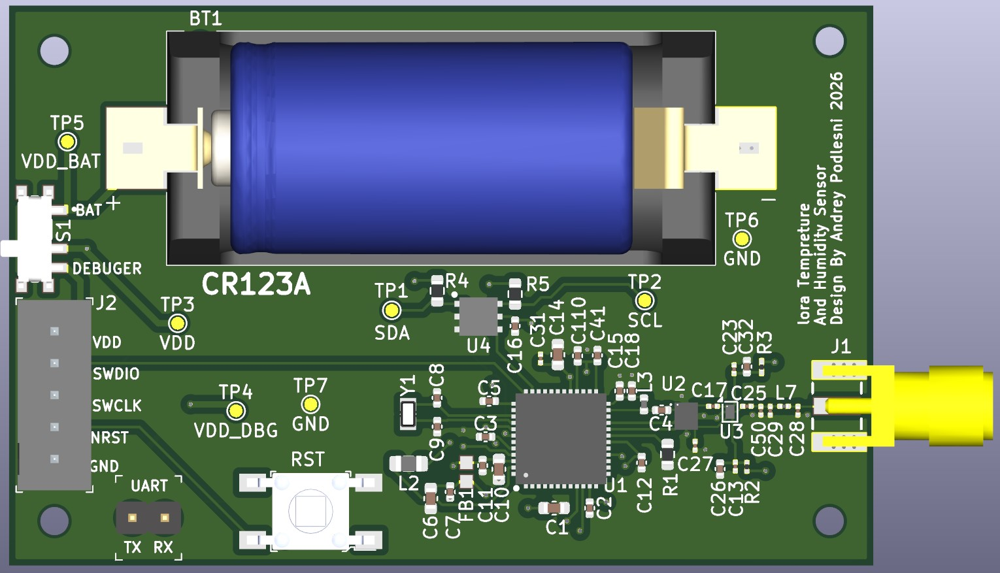
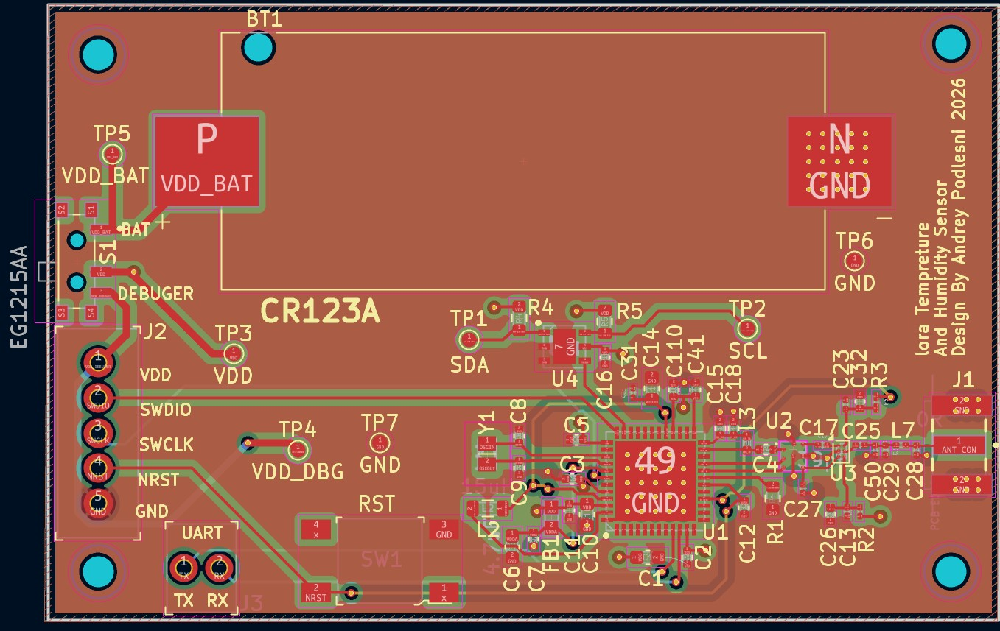
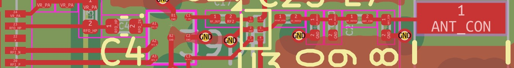

# STM32WL LoRa RF PCB (KiCad)

## Overview
This is a 4-layer PCB design of a LoRa sensor node based on the STM32WLE5CCU6.  
It includes a temperature and humidity sensor (HDC2022) and an RF path to an SMA antenna.  
The board was designed in KiCad with focus on a working hardware setup and easy bring-up.  
The RF section follows the STM32WL development board schematics and layout guidelines.

---

## PCB Layout

---

## Key Features  
- STM32WLE5CCU6 (LoRa MCU)  
- HDC2022 temperature & humidity sensor  
- SMA antenna interface  
- 4-layer PCB  
- Battery powered (CR123A)  
- SWD debug interface + UART pins  

---

## Hardware Blocks  
  
### MCU  
STM32WLE5CCU6 with integrated Sub-GHz radio (LoRa).  
Combines MCU and RF transceiver in a single chip, reducing external components and simplifying the design.  

---

### RF Path  
- RF output from the MCU is routed through a matching network to an SMA antenna  
- RF routing implemented as a 50Ω microstrip based on PCB stackup calculations  
- Matching network includes optional components for antenna tuning  

---

### Sensor  
HDC2022 connected over I²C for temperature and humidity measurement  

---

### Battery  
CR123A lithium battery used as the main power source  

Selected for its ability to handle LoRa transmission current peaks and provide reliable long-term operation in a low-duty-cycle system  

Estimated battery life is over 2 years, based on power estimation using STM32CubeMX Power Consumption Calculator  

---

### Debug  
SWD interface and UART pins for programming and debugging  

---

## RF Notes
- RF traces routed as 50Ω controlled impedance  
- Microstrip routing over solid ground plane  
- RF path kept on a single layer (no vias)  

---

## Design Notes
- Matching network allows antenna tuning during testing  
- Battery selected to support LoRa current peaks  
- Power path prevents back-powering during debugging  

---
## Future Improvements
- Refine RF impedance control by considering copper pour clearance and surrounding geometry
- Improve sensor placement to reduce thermal influence from other components
- Further layout optimization for production readiness

## Tools
- KiCad 9  

---

## License
MIT
